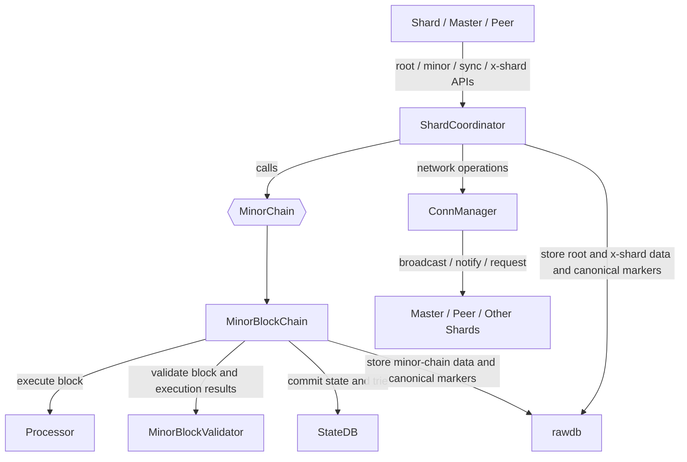
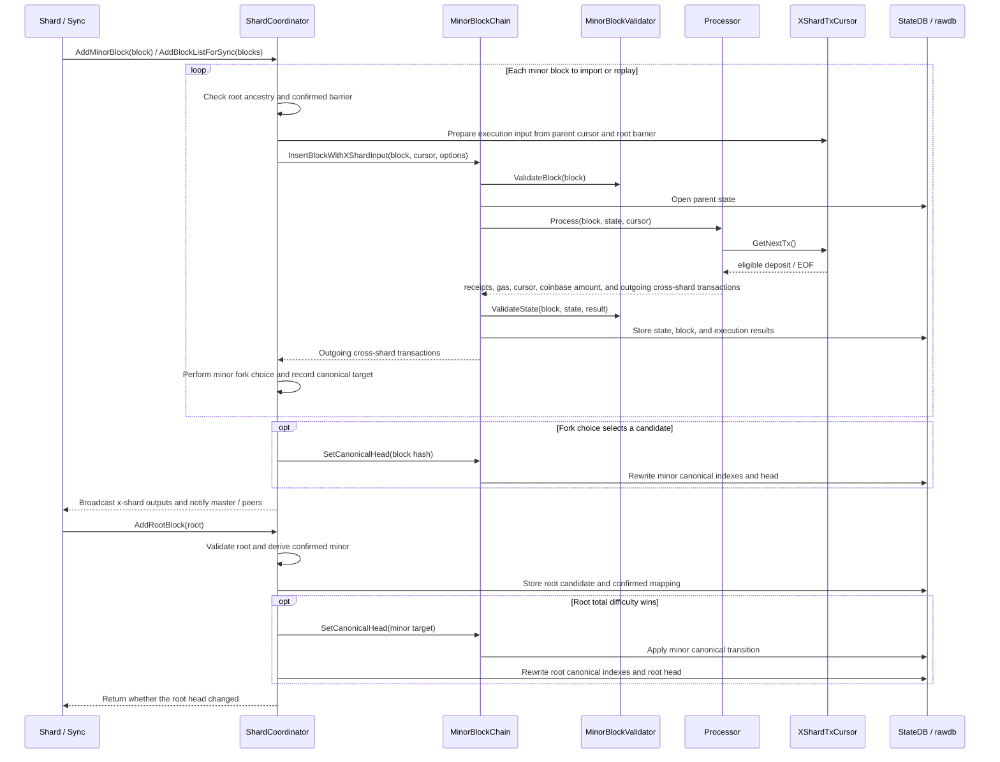

# QuarkChain Minor Chain: Two-Layer Architecture

This document describes the two-layer model inside a QuarkChain shard:
`ShardCoordinator` processes root blocks, selects root/minor heads, and prepares
incoming cross-shard transaction inputs; `MinorBlockChain` executes and stores
minor blocks and applies canonical chain transitions to the selected head.

It covers the responsibilities of both layers, API call relationships, and the
main interaction flows.
pyquarkchain is the reference for protocol-observable behavior; goquarkchain is the
implementation reference for GoShard; geth provides underlying StateDB, trie, and
database support, with its state commit and canonical transition implementations
used as references when needed.

## 1. Background and Design Goals

The minor chain links blocks by parent hash, executes ordinary transactions and
incoming cross-shard deposits on the parent state, and stores state, receipts,
and outgoing cross-shard transactions. The root chain determines the canonical
root blocks and confirms each shard's minor headers and confirmed minor blocks.

The original implementation also placed QuarkChain-specific root and x-shard
logic inside `MinorBlockChain`. This increased complexity and divergence from
geth, making subsequent geth changes harder to incorporate and maintain.

These responsibilities are therefore split between `MinorBlockChain` and
`ShardCoordinator`:

- Local execution does not need to understand root consensus, making it easier to reuse and track geth implementations.
- Minor-block insertion is separate from canonical head selection.
- QuarkChain-specific root and x-shard logic is concentrated in `ShardCoordinator`, simplifying the implementation and comparison with pyquarkchain.

The current scope uses HashDB/MPT archive state. PathDB, snapshots, SnapSync,
pruning, and trie GC do not change the two-layer responsibility boundaries and
are outside the current implementation scope.

## 2. Layer Responsibilities

### 2.1 Minor Block Chain

`MinorBlockChain` owns local minor blocks, state, and canonical indexes. It:

- Calls `Processor` to execute a block on its parent block's state.
- Calls `MinorBlockValidator` to validate the block and execution results.
- Commits StateDB and the trie, and writes the block, receipts, and execution results.
- Provides candidate insertion, block/state queries, and canonical chain transition APIs required by `ShardCoordinator`.
- Provides local-chain query APIs required by RPC/API consumers.

### 2.2 Shard Coordinator

`ShardCoordinator` handles shard logic that depends on the root chain and
coordinates `MinorBlockChain`. It:

- Checks dependencies during construction, including QuarkChain/shard configuration, the database, `MinorBlockChain`, and `ConnManager`.
- Uses `InitFromRootBlock` to initialize or restore the root tip, confirmed minor block, and local minor head from a root block.
- Validates and stores root blocks, and updates the root tip according to root fork choice.
- Validates shard-specific and root-related minor-block rules, prepares cross-shard transaction input, and calls `MinorBlockChain` to insert candidates.
- Selects a canonical target according to minor fork choice and calls `SetCanonicalHead` to apply the selection.
- Broadcasts outgoing cross-shard transactions and publishes minor headers and tips to the master or peers.
- Provides root/minor block insertion and x-shard list reception APIs for the shard, master, and sync layers.

## 3. MinorBlockChain Implementation Choice

Three implementation approaches were considered:

| Approach | Advantages | Main Challenges |
| --- | --- | --- |
| Simplify geth `core.BlockChain` | Mature state, canonical chain, reorg, and recovery logic | Extensive Ethereum-specific logic requires substantial type adaptation and code removal |
| Remove root-related logic from goquarkchain `MinorBlockChain` | Already uses QuarkChain blocks, accounts, receipts, and database structures | Root and x-shard responsibilities must move to `ShardCoordinator` |
| Reimplement from pyquarkchain while removing root-related logic | Easiest to compare with QuarkChain protocol behavior | Python state, database, and execution models cannot directly reuse geth's Go infrastructure |

The current implementation chooses the second approach because it is closest to
the existing QuarkChain types and database structures, with the smallest relative
scope of changes. Existing minor-block execution, state storage, and canonical
chain management can be retained, while root and x-shard responsibilities move
to `ShardCoordinator`. The underlying implementation continues to use geth's
StateDB, MPT, HashDB, and database APIs, referring to geth's state commit, head
recovery, and canonical transition implementations as needed. Protocol behavior
follows pyquarkchain.

The current implementation also removes full mode and supports only HashDB/MPT
archive mode. Full mode uses trie caching and GC to manage state retention and
does not guarantee that every historical state root can be reopened. If state
needed for side-chain execution or restart has been pruned, execution must be
replayed from an ancestor with available state, or the local head must be
repaired. Archive mode persists every state root and excludes trie GC, state
pruning, and missing-state repair. This reduces state commit and recovery
complexity at the cost of continued database growth. pyquarkchain currently also
uses archive-style state storage exclusively.

## 4. Interfaces and Call Relationships

The direct boundary between the two layers is `MinorChain`. The interface
required by the current coordinator can be summarized as follows:

```go
type MinorChain interface {
	CurrentBlock() *types.MinorBlock
	GetBlock(hash common.Hash) *types.MinorBlock
	GetBlockByNumber(number uint64) *types.MinorBlock
	HasBlockAndState(hash common.Hash) bool
	HasState(root common.Hash) bool
	InsertBlockWithXShardInput(block *types.MinorBlock, cursor *XShardTxCursor,
		options InsertOptions) ([]*types.CrossShardTransactionDeposit, error)
	SetCanonicalHead(hash common.Hash) error
	Stop()
}
```

`InsertBlockWithXShardInput` validates, executes, and stores a candidate.
`ShardCoordinator` then performs fork choice and calls `SetCanonicalHead(hash)`
only when the candidate wins.

The differences from the original monolithic implementation are important:

| Interface | Current Semantics | Difference from the Original Implementation |
| --- | --- | --- |
| `InsertBlockWithXShardInput` | Executes and stores a candidate using the coordinator-provided `XShardTxCursor`, returning outgoing cross-shard transactions | Inserts one block at a time without selecting the canonical head |
| `XShardTxCursor.GetNextTx()` | Lets `Processor` obtain the next eligible incoming cross-shard transaction in execution order | The cursor encapsulates root-chain, shard-range, and x-shard list information that `MinorBlockChain` does not need to understand |
| `SetCanonicalHead(hash)` | Makes a stored target with available state the canonical head | The coordinator selects the target; `MinorBlockChain` only applies the canonical chain transition |

`ShardCoordinator` constructs the cursor and selects the canonical target.
`MinorBlockChain` passes the cursor to `Processor`, which obtains cross-shard
transactions only through `GetNextTx()`.

The main `ShardCoordinator` entry points exposed to the shard/master are:

```go
func (c *ShardCoordinator) InitFromRootBlock(root *types.RootBlock) error
func (c *ShardCoordinator) AddRootBlock(root *types.RootBlock) (bool, error)
func (c *ShardCoordinator) AddMinorBlock(block *types.MinorBlock) error
func (c *ShardCoordinator) AddBlockListForSync(blocks []*types.MinorBlock) error
func (c *ShardCoordinator) AddXShardTxList(hash common.Hash,
	deposits []*types.CrossShardTransactionDeposit) error
```



## 5. Main Interaction Flows



### 5.1 AddMinorBlock

`AddMinorBlock` handles the first delivery of a minor block:

1. Check basic import conditions, including running state, known-block status, and parent availability.
2. Validate shard-specific rules and root-related rules such as the previous-root reference and confirmed barrier.
3. Construct `XShardTxCursor` from the parent cursor and root barrier.
4. Call `MinorBlockChain` to execute and store the candidate.
5. Perform minor fork choice and call `SetCanonicalHead` if needed.
6. Broadcast outgoing cross-shard transactions, submit the header, and broadcast a new tip if the head changed.

If local persistence succeeds but propagation fails, the call returns a network
error while the block and state remain stored. A subsequent `AddMinorBlock` call
returns immediately when it detects the existing block and does not retry
propagation. Use `AddBlockListForSync` when propagation must be retried.

### 5.2 AddBlockListForSync

`AddBlockListForSync` is the batch entry point for importing minor blocks during
root sync. It can also re-execute and re-propagate known blocks after propagation
failure. Root sync may omit intermediate parents already available locally.
Every block actually supplied in the list is re-executed with `ForceInsert`,
including blocks that are already stored.

The flow is:

1. Check running state and basic import conditions, including blocks, ordering, and parent availability.
2. Validate each block's shard-specific and root-related rules, including the previous-root reference and confirmed barrier.
3. Construct each cursor and execute or replay each block with `ForceInsert`.
4. Collect outgoing cross-shard transactions and calculate fork choice per block according to pyquarkchain semantics.
5. After all candidates are stored, call `SetCanonicalHead` once for the last eligible block.
6. Broadcast outgoing cross-shard transactions in batches and send the header list to the master.

### 5.3 AddRootBlock

`AddRootBlock` handles a root candidate and updates root and minor canonical
state when it wins:

1. Validate the root, parent continuity, local minor blocks, and remote x-shard data.
2. Derive the last minor block confirmed by the root.
3. Store the root candidate and confirmed mapping.
4. Retain it as a side root if its TD does not exceed the current root tip's TD.
5. If the new root wins, select the minor target using the confirmed minor block and root ancestry.
6. Call `SetCanonicalHead` to change the minor head, then rewrite the root canonical index and update the in-memory tips.

Root sync must synchronize the minor blocks included in a root block before
calling `AddRootBlock`. A minor block referencing a side root therefore must not
be rejected merely for that reference during downloading. It must first be
stored as a candidate and may enter the canonical minor chain after the
corresponding root branch wins.

Storing a root block and changing the canonical chain are separate steps. If the
root block is stored but a subsequent minor-head or root-head update fails,
resubmitting that root must continue the unfinished canonical transition rather
than return immediately just because the root already exists in the database.

### 5.4 Fork Choice and Canonical Transition

First distinguish these concepts:

- **Fork choice** is the decision: `ShardCoordinator` selects a new canonical target from stored candidates according to protocol rules. It includes root-driven fork choice and minor-block fork choice.
- **Canonical transition** is the execution: `MinorBlockChain` uses `SetCanonicalHead` to change the current head to the coordinator-selected target.
- **Extension, rewind, and reorg** are three forms of canonical transition: an extension occurs when the current head is an ancestor of the target; a rewind occurs when the target is an ancestor of the current head; a reorg occurs only when the current head and target lie on different branches.

Fork choice therefore does not directly rewrite the canonical chain, and reorg
is not a synonym for fork choice. The two layers connect through
`SetCanonicalHead(target.Hash())`: the coordinator decides which target to pass,
and `MinorBlockChain` decides how to apply the transition.

The call hierarchy for a single minor block is:

```text
AddMinorBlock(block)
  -> validateMinorBlockRootReference(block, parentBlock)
  -> InsertBlockWithXShardInput(block, cursor, options)
     -> Execute, validate, and store candidate
  -> shouldUpdateMinorHead(block, previousRoot)
     -> false: Keep candidate in the database
     -> true:
        -> MinorBlockChain.SetCanonicalHead(block.Hash())
```

Batch sync performs fork choice per block but applies one canonical transition
for the last winning target:

```text
AddBlockListForSync(blocks)
  -> Iterate over blocks
     -> validateMinorBlockRootReference(block, parentBlock)
     -> InsertBlockWithXShardInput(block, cursor, options)
        -> Execute, validate, and store candidate
     -> shouldUpdateMinorHead(block, previousRoot)
        -> true: Record canonicalTarget
  -> canonicalTarget != nil
     -> MinorBlockChain.SetCanonicalHead(canonicalTarget.Hash())
```

Root-driven fork choice first selects a root branch, then selects a minor target
using that root's confirmation and ancestry:

```text
AddRootBlock(root)
  -> deriveConfirmedMinorBlock(root)
  -> writeRootBlock(root, confirmed)
     -> Store root candidate and confirmed mapping
  -> Compare root.TotalDifficulty() with the current root tip
     -> Does not win: Keep as side root and return
     -> Wins:
        -> setMinorHeadForCanonicalRoot(root, confirmed)
           -> Calculate final minor target from confirmed minor and root ancestry
           -> target != current
              -> MinorBlockChain.SetCanonicalHead(target.Hash())
        -> setCurrentRootBlock(root)
           -> Update root canonical index and head markers
        -> Update rootTip and confirmedMinorTip
```

`setMinorHeadForCanonicalRoot` calculates the final minor target and calls
`SetCanonicalHead` at most once. The target may lie on a newly confirmed minor
branch or may be an ancestor of the current head, removing an unconfirmed suffix
that references the old root branch.

The execution hierarchy of `SetCanonicalHead` is:

```text
MinorBlockChain.SetCanonicalHead(hash)
  -> GetBlock(hash)
  -> setHead(target)
     -> Check target state
     -> Align current head and target heights
     -> Find common ancestor
     -> Update canonical index and head markers in a batch
     -> Update in-memory current head
```

`MinorBlockChain` handles common-ancestor lookup, removal of old canonical
indexes, and writing new canonical indexes. `ShardCoordinator` does not
participate in these local-chain transition details.

## 6. Current Implementation and References

The current implementation is split across three PRs:

| PR | Location or Branch | Main Responsibilities |
| --- | --- | --- |
| PR 1 | `goshard/goshard/qkc/core`, `qkc-shard-root-coordinator` | Coordinator initialization, root import, confirmed minor tracking, root canonical state, and root-driven minor transitions |
| PR 2 | `goshard/goshard/qkc/core`, `qkc-shard-root-coordinator-2` | `AddMinorBlock`, `AddBlockListForSync`, minor fork choice, x-shard cursor, and propagation |
| PR 3 | Currently remains in `goshard/qkc/core` | `MinorBlockChain`, `BlockProcessor`, `MinorBlockValidator`, and local execution code not yet moved into the inner repository |

These PRs describe the current implementation mapping, not a proposed new code
layout. Reviews should check whether the interfaces preserve the ownership
defined here, rather than require each PR to independently implement the other
layer's internal details.
