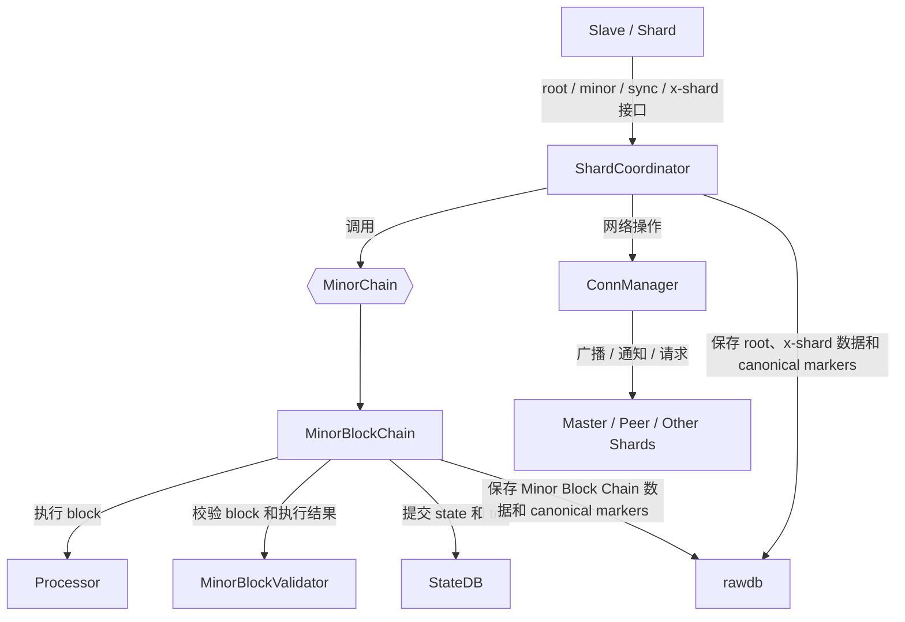
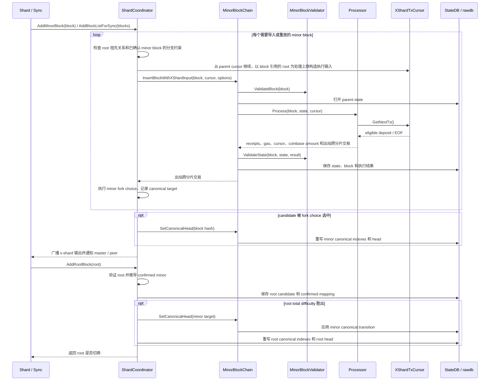

# GoShard Minor Block Chain 两层架构

本文说明 GoShard Minor Block Chain 的两层模型：
- `ShardCoordinator` 负责处理 root block 验证、选择 root/minor head，并负责跨分片交易管理；
- `MinorBlockChain` 负责执行和保存 minor block，以及按选出的 head 切换 canonical chain。

本文介绍这两层的职责划分、接口调用关系和主要交互流程。
协议可观察行为以 pyquarkchain 为准；goquarkchain 用作 GoShard 的实现参考；
geth 提供 StateDB、trie 和数据库等底层支持，state 提交和 canonical 切换的实现按需参考 geth。

## 1. 背景与设计目标

Minor Block Chain 按 parent hash 串联 block，在父状态上执行普通交易和入站跨链交易（x-shard deposits），
并保存 state、receipt 和出站跨链交易。Root chain 确定 canonical root block，在 root block 
中确认各 shard 的 minor headers 和 confirmed minor block。

原有实现将 root、x-shard 等 QKC 逻辑也放在 `MinorBlockChain` 中，使代码复杂且与 geth 差异较大，
不利于引入和维护 geth 的后续改动。

因此将这些职责拆分到 `MinorBlockChain` 和 `ShardCoordinator` 两层。这样：

- 本地执行不需要理解 QKC 特有逻辑，可以更直接地复用和同步 geth 的实现；
- minor block 的插入和 canonical head 的选择分离；
- QKC 特有的 root、x-shard 逻辑集中在 `ShardCoordinator`，使其实现更简单直观，也便于与 pyquarkchain 对照。

当前范围使用 HashDB/MPT archive state。PathDB、snapshot、SnapSync、pruning 和
trie GC 不影响两层职责边界，不在当前实现范围。

## 2. 两层职责

### 2.1 Minor Block Chain

`MinorBlockChain` 是本地 minor block、state 和 canonical index 的 owner。它负责：

- 基于 parent block 的 state 调用 `Processor` 执行 block；
- 调用 `MinorBlockValidator` 校验 block 和执行结果；
- 提交 StateDB 和 trie，并写入 block、receipt 及执行结果；
- 对外提供 `ShardCoordinator` 所需的 candidate 插入、block/state 查询和 canonical chain 切换接口；
- 对外提供 RPC/API 所需的本地链查询接口。

### 2.2 Shard Coordinator

`ShardCoordinator` 集中处理依赖 root chain 的 shard 逻辑，并协调 `MinorBlockChain`：

- 构造时检查 QKC/shard 配置、数据库、`MinorBlockChain` 和 `ConnManager` 等依赖；
- 通过 `InitFromRootBlock` 从 root block 初始化或恢复 root tip、confirmed minor 和本地 minor head；
- 验证并保存 root block，根据 root fork choice 更新 root tip；
- 验证 minor block 的 shard 和 root 相关规则，构造跨分片交易输入，并调用 `MinorBlockChain` 插入 candidate；
- 根据 minor fork choice 选择 canonical target，并调用 `SetCanonicalHead` 应用选择；
- 广播出站跨分片交易，并向 master 或 peer 发布 minor header 和 tip；
- 对外提供 shard、master 和 sync 所需的 root/minor block 插入及 x-shard list 接收接口。

## 3. MinorBlockChain 实现选型

`MinorBlockChain` 的实现考虑了以下三种方案：

| 方案 | 优点 | 主要问题 |
| --- | --- | --- |
| 在 geth `core.BlockChain` 上简化 | state、canonical chain、reorg 和恢复逻辑成熟 | Ethereum 专用逻辑较多，类型适配和裁剪范围较大 |
| 在 goquarkchain `MinorBlockChain` 上移除 root 相关内容 | 已使用 QuarkChain block、账户、receipt 和数据库结构 | 需要将 root 和 x-shard 相关职责移到 `ShardCoordinator` |
| 参考 pyquarkchain 重新实现并移除 root 相关内容 | 最容易对照 QuarkChain 协议行为 | Python 的状态、数据库和执行模型无法直接复用 geth 的 Go 基础设施 |

当前选择第二种方案，因为它与现有 QuarkChain 类型和数据库结构最接近，改动范围相对最小。原有的 minor block 
执行、state 保存和 canonical chain 管理可以继续使用，只需将 root 和 x-shard 相关职责移到 `ShardCoordinator`。
底层继续使用 geth 的 StateDB、MPT、HashDB 和数据库接口，并按需参考geth 的 state commit、head recovery 和
canonical transition 实现。协议行为以 pyquarkchain 为准。

同时，当前实现去掉 full mode，只支持 HashDB/MPT archive mode。full mode 通过 trie 缓存和 GC 管理状态保留，不保证每个历史 
state root 都可重新打开。当 side-chain 执行或重启所需的 state 已被裁剪时，还需要从 state 可用的祖先重放，或修复本地 head。
archive mode 下每个 state root 都会持久化，不包含 trie GC、state pruning 和缺失 state 修复逻辑。这降低了 state commit 
和恢复复杂度，代价是数据库空间会持续增长。pyquarkchain 当前也只支持 archive 式状态存储。

## 4. 接口与调用关系

两层之间的直接边界是 `MinorChain`。当前 coordinator 需要的接口可以概括为：

```go
type MinorChain interface {
	CurrentBlock() *types.MinorBlock
	GetBlock(hash common.Hash) *types.MinorBlock
	GetBlockByNumber(number uint64) *types.MinorBlock
	HasBlockAndState(hash common.Hash) bool
	HasState(root common.Hash) bool
	InsertBlockWithXShardInput(block *types.MinorBlock, cursor *XShardTxCursor,
		options InsertOptions) ([]*types.CrossShardTransactionDeposit, error)
	SetCanonicalHead(hash common.Hash) error
	Stop()
}
```

`InsertBlockWithXShardInput` 验证、执行并保存一个 candidate。`ShardCoordinator` 随后完成
fork choice，只有 candidate 胜出时才调用 `SetCanonicalHead(hash)`。

这几个接口与原有单体实现的差异需要特别说明：

| 接口 | 当前语义 | 与原有实现的区别 |
| --- | --- | --- |
| `InsertBlockWithXShardInput` | 使用 coordinator 为该 block 构造的 `XShardTxCursor` 执行并保存 candidate，返回出站跨分片交易 | 每次只插入一个 block，插入过程不选择 canonical head |
| `XShardTxCursor.GetNextTx()` | `Processor` 按执行顺序取得下一笔可执行的入站跨分片交易 | cursor 封装 root chain、分片范围和 x-shard list 信息，`MinorBlockChain` 不需要理解这些上层信息 |
| `SetCanonicalHead(hash)` | 将已保存且 state 可用的 target 设为 canonical head | target 由 coordinator 选择，`MinorBlockChain` 只完成 canonical chain 切换 |

`ShardCoordinator` 构造 cursor 并选择 canonical target；`MinorBlockChain` 将 cursor
传给 `Processor`，`Processor` 只通过 `GetNextTx()` 获取跨分片交易。

`ShardCoordinator` 对 shard/master 暴露的主要入口是：

```go
func (c *ShardCoordinator) InitFromRootBlock(root *types.RootBlock) error
func (c *ShardCoordinator) AddRootBlock(root *types.RootBlock) (bool, error)
func (c *ShardCoordinator) AddMinorBlock(block *types.MinorBlock) error
func (c *ShardCoordinator) AddBlockListForSync(blocks []*types.MinorBlock) error
func (c *ShardCoordinator) AddXShardTxList(hash common.Hash,
	deposits []*types.CrossShardTransactionDeposit) error
```



## 5. 主要交互流程



### 5.1 AddMinorBlock

`AddMinorBlock` 处理一个首次收到的 minor block：

1. 检查运行状态、known-block 和 parent 等基本导入条件；
2. 验证 block 的 shard 规则和 previous-root 引用，并检查 parent 是否延续该 root 已确认的 minor chain；
3. 从 parent cursor 继续，以 block 引用的 root 为处理上限构造 `XShardTxCursor`；
4. 调用 `MinorBlockChain` 执行并保存 candidate；
5. 执行 minor fork choice，必要时调用 `SetCanonicalHead`；
6. 广播出站跨分片交易、提交 header，并在 head 改变时广播新 tip。

如果本地写入成功而传播失败，调用返回网络错误，但 block 和 state 仍然存在。
再次调用 `AddMinorBlock` 时，检测到 block 已存在后会直接返回，不会补发；需要补发时应调用
`AddBlockListForSync`。

### 5.2 AddBlockListForSync

`AddBlockListForSync` 是 root sync 导入 minor blocks 的批量入口，也可在已知 block 
传播失败后用于重新执行和补发。Root sync 可以省略本地已有的中间 parent；列表中实际
传入的每个 block 都会通过 `ForceInsert` 重新执行，包括已经存在的 block。

处理流程是：

1. 检查运行状态，以及列表中 block、顺序和 parent 等基本导入条件；
2. 逐块验证 block 的 shard 规则和 previous-root 引用，并检查 parent 是否延续该 root 已确认的 minor chain；
3. 逐块构造 cursor，并使用 `ForceInsert` 执行或重放；
4. 保留出站跨分片交易，并按 pyquarkchain 语义逐块计算 fork choice；
5. 全部 candidate 保存后，只对最后一个 eligible block 调用一次 `SetCanonicalHead`；
6. 批量广播出站跨分片交易，并把 header list 发给 master。

### 5.3 AddRootBlock

`AddRootBlock` 处理 root candidate，并在它胜出时更新 root 和 minor canonical 状态：

1. 验证 root、parent continuity，以及本地 minor 和远端 x-shard 数据；
2. 推导 root 对应的最后 confirmed minor；
3. 保存 root candidate 和 confirmed mapping；
4. TD 没有超过当前 root tip 时，将它保留为 side root；
5. 新 root 胜出时，根据 confirmed minor 和 root ancestry 选择 minor target；
6. 调用 `SetCanonicalHead` 切换 minor head，再重写 root canonical index 和内存 tips。

Root sync 必须先同步 root block 包含的 minor blocks，再调用 `AddRootBlock`。因此引用side-root 的 minor block 
不能在下载阶段被拒绝；它必须先作为 candidate 保存到数据库，等对应 root branch 胜出后再进入 canonical Minor Block Chain。

保存 root block 和切换 canonical chain 是两个独立步骤。如果 root block 已经保存，但后续的 minor head 或 root head 
更新失败，再次提交该 root 时，应继续完成未完成的 canonical 切换，不能仅因数据库中已存在该 root 就直接返回。

### 5.4 Fork choice 与 canonical transition

先区分以下概念：

- **Fork choice** 是决策：`ShardCoordinator` 根据协议规则，从已保存的 candidates 中选出
  新的 canonical target。它包括 root-driven fork choice 和 minor block fork choice。
- **Canonical transition** 是执行：`MinorBlockChain` 通过 `SetCanonicalHead`，把 current
  head 切换到 coordinator 选出的 target。
- **Extension、rewind 和 reorg** 是 canonical transition 的三种形态：current head 是
  target 的祖先时是 extension；target 是 current head 的祖先时是 rewind；current 与
  target 位于不同分支时才是 reorg。

因此，fork choice 不直接改写 canonical chain，reorg 也不是 fork choice 的同义词。
两层通过 `SetCanonicalHead(target.Hash())` 衔接：coordinator 负责传入哪个 target，
`MinorBlockChain` 负责如何完成切换。

单个 minor block 的调用层次如下：

```text
AddMinorBlock(block)
  -> validateMinorBlockRootReference(block, parentBlock)
  -> InsertBlockWithXShardInput(block, cursor, options)
     -> 执行、校验并保存 candidate
  -> shouldUpdateMinorHead(block, previousRoot)
     -> false: candidate 保留在数据库中
     -> true:
        -> MinorBlockChain.SetCanonicalHead(block.Hash())
```

批量同步逐块执行 fork choice，但只对最后一个胜出的 target 应用一次 canonical transition：

```text
AddBlockListForSync(blocks)
  -> 遍历 blocks
     -> validateMinorBlockRootReference(block, parentBlock)
     -> InsertBlockWithXShardInput(block, cursor, options)
        -> 执行、校验并保存 candidate
     -> shouldUpdateMinorHead(block, previousRoot)
        -> true: 记录 canonicalTarget
  -> canonicalTarget != nil
     -> MinorBlockChain.SetCanonicalHead(canonicalTarget.Hash())
```

Root-driven fork choice 先选择 root branch，再根据该 root 的 confirmation 和 ancestry
选择 minor target：

```text
AddRootBlock(root)
  -> deriveConfirmedMinorBlock(root)
  -> writeRootBlock(root, confirmed)
     -> 保存 root candidate 和 confirmed mapping
  -> 比较 root.TotalDifficulty() 与 current root tip
     -> 未胜出: 保留为 side root 并返回
     -> 胜出:
        -> setMinorHeadForCanonicalRoot(root, confirmed)
           -> 根据 confirmed minor 和 root ancestry 计算最终 minor target
           -> target != current
              -> MinorBlockChain.SetCanonicalHead(target.Hash())
        -> setCurrentRootBlock(root)
           -> 更新 root canonical index 和 head markers
        -> 更新 rootTip 和 confirmedMinorTip
```

`setMinorHeadForCanonicalRoot` 只计算最终 minor target，并最多调用一次
`SetCanonicalHead`。该 target 可能位于新确认的 minor branch，也可能是当前 head 的某个
祖先，用于移除引用旧 root branch 的未确认 suffix。

`SetCanonicalHead` 的执行层次如下：

```text
MinorBlockChain.SetCanonicalHead(hash)
  -> GetBlock(hash)
  -> setHead(target)
     -> 检查 target state
     -> 对齐 current head 与 target 的高度
     -> 查找共同祖先
     -> 批量更新 canonical index 和 head markers
     -> 更新内存 current head
```

共同祖先查找、旧 canonical index 清理和新 canonical index 写入都由
`MinorBlockChain` 完成。`ShardCoordinator` 不参与这些本地链切换细节。

## 6. 当前实现与参考

当前实现分成三个 PR：

| PR | 位置或分支 | 主要职责 |
| --- | --- | --- |
| PR 1 | `goshard/goshard/qkc/core`，`qkc-shard-root-coordinator` | coordinator 初始化、root 导入、confirmed minor、root canonical 和 root-driven minor 切换 |
| PR 2 | `goshard/goshard/qkc/core`，`qkc-shard-root-coordinator-2` | `AddMinorBlock`、`AddBlockListForSync`、minor fork choice、x-shard cursor 和传播 |
| PR 3 | 当前仍在 `goshard/qkc/core` | `MinorBlockChain`、`BlockProcessor`、`MinorBlockValidator` 以及尚未移入内层仓库的本地执行代码 |

这三个 PR 是当前实现映射，不是新的代码布局建议。Review 时应检查接口是否保持本文
定义的所有权，而不是要求每个 PR 独立实现另一层的内部细节。
